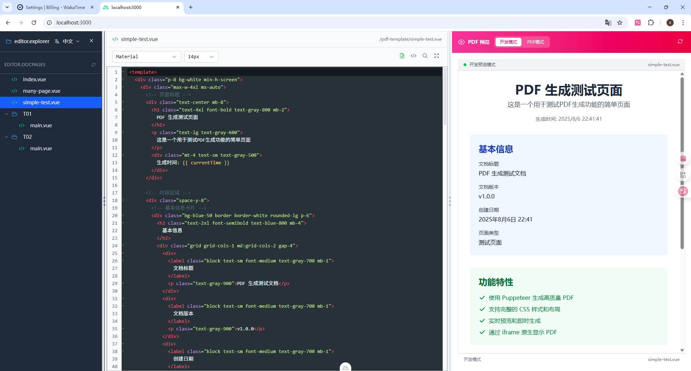
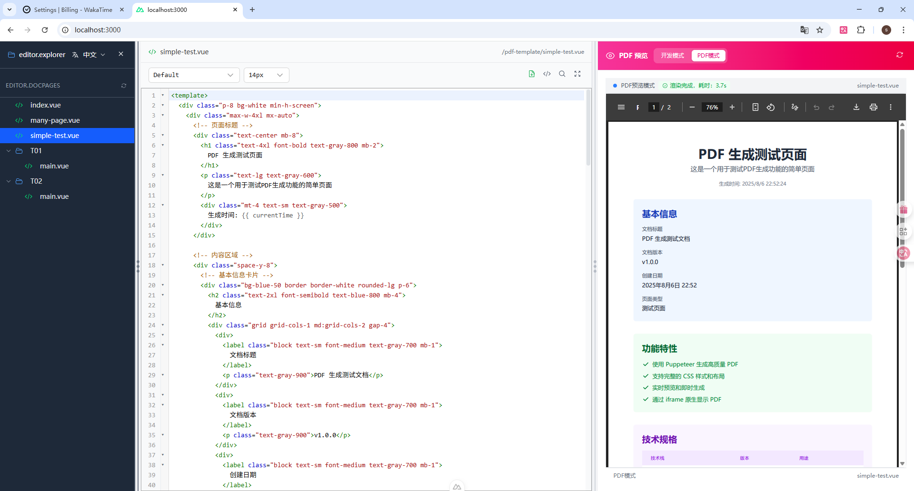

# Report Make Template

一个基于 Nuxt.js 和 Vue.js 的 PDF 模板、动态报告模板编辑器，参考 jsreport 的设计风格。

## 项目地址：
 ### github：https://github.com/seavan-ning/report-make-template
 ### gitcode：https://gitcode.com/seavan_ning/report-make-template
 gitee：https://gitee.com/louisxc/report-make-template

## 功能特性

### ✅ 已完成功能

1. **三栏布局设计**
   - 左侧：可隐藏的文件树浏览器
   - 中间：代码编辑器区域
   - 右侧：PDF 预览区域
   - 支持拖拽调整各区域宽度

2. **文件树浏览器**
   - 深色主题设计，类似 jsreport 风格
   - 支持文件夹展开/收起
   - 文件类型图标显示
   - 文件选择高亮
   - 可隐藏/显示

3. **代码编辑器**
   - 语法高亮支持（HTML、JavaScript、JSON、CSS等）
   - 行号显示
   - 文件标签显示
   - 工具栏按钮
   - 自定义滚动条

4. **PDF 预览区域**
   - 简化的预览界面
   - 工具栏设计
   - 占位内容显示

5. **响应式设计**
   - 支持拖拽调整宽度
   - 最小/最大宽度限制
   - 窗口大小自适应

### 🎨 设计风格

- 参考 jsreport 的界面设计
- 深色侧边栏配色方案
- 现代化的 UI 组件
- 清晰的视觉层次

### 📁 项目结构


```
├── app/                      # 前端主应用目录
│   ├── app.vue               # 应用入口组件，负责全局布局
│   ├── app.config.ts         # 应用配置
│   ├── assets/               # 静态资源（如样式、图片）
│   ├── components/           # 通用 UI 组件
│   │   ├── FileTree.vue      # 文件树主组件
│   │   ├── FileTreeItem.vue  # 文件树单项组件
│   │   ├── CodeEditor.vue    # 代码编辑器组件
│   │   ├── PdfPreview.vue    # PDF 预览组件
│   ├── layouts/              # 页面布局组件
│   ├── pages/                # 路由页面目录
│   ├── plugins/              # 插件（如 pinia 状态管理）
│   ├── stores/               # 状态管理（如 pinia store）
├── public/                   # 公共静态资源
├── server/                   # 后端 API 及服务端逻辑
├── composables/              # 组合式函数（如 useFileSystem）
├── config.ts                 # 全局配置
├── nuxt.config.ts            # Nuxt 配置文件
```

主要目录说明：
- `app/`：前端主应用，包含页面、组件、布局、插件等。
- `public/`：静态资源目录，直接对外暴露。
- `server/`：后端 API 及服务端逻辑。
- `composables/`：可复用的组合式函数。
- `config.ts`、`nuxt.config.ts`：全局和框架配置文件。

### 🛠️ 技术栈

- **框架**: Nuxt.js 4.0.1
- **UI库**: Nuxt UI 3.3.0
- **样式**: Tailwind CSS
- **语法高亮**: Prism.js
- **图标**: Heroicons
- **包管理**: pnpm

### 🚀 快速开始

1. 安装依赖：
   ```bash
   pnpm install
   ```

2. 启动开发服务器：
   ```bash
   pnpm dev
   ```

3. 打开浏览器访问：
   ```
   http://localhost:3000
   ```

### 📋 示例文件

项目包含以下示例文件：

- **templates/invoice.html** - 发票模板
- **templates/report.html** - 报告模板
- **helpers/formatters.js** - 格式化工具函数
- **data/sample.json** - 示例数据
- **package.json** - 项目配置

### 🔧 主要功能

1. **文件浏览**
   - 点击文件树中的文件查看内容
   - 支持多种文件类型的语法高亮

2. **布局调整**
   - 拖拽分隔条调整区域宽度
   - 点击按钮隐藏/显示文件树

3. **代码查看**
   - 行号显示
   - 语法高亮
   - 文件类型识别

### 🎯 下一步计划

- [ ] 完善 PDF 预览功能
- [ ] 添加代码编辑功能
- [ ] 实现模板编译
- [ ] 添加数据绑定
- [ ] 支持文件上传
- [ ] 添加主题切换

### 📋项目示例图

1. **开发模式**

   

2. **PDF模式**

   


### 🤝 贡献

欢迎提交 Issue 和 Pull Request 来改进这个项目。

### 📄 许可证

MIT License


 * @license
 * [report-make-template] 版权所有 (c)
   @Author seavan_ning
   @Email <seavan093@gmail.com>
 * 基于 MIT 许可证开源（完整协议见项目根目录 LICENSE 文件）
 * 允许修改/商用，但需保留本声明及作者信息和联系方式
